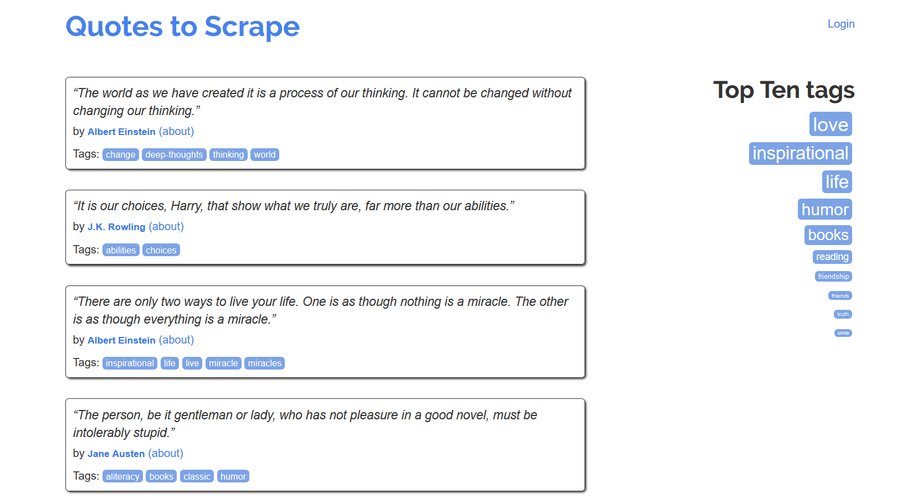
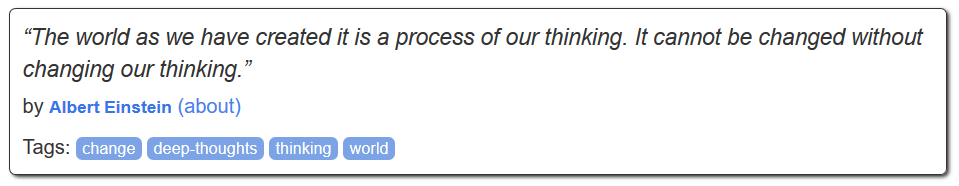

#  📜 Citações Web Crawler



## Criando Um Novo Projeto

Antes de começarmos nossa coleta de dados, você precisa configurar um novo projeto Scrapy; caso contrário nada funcionará! 
Usando a ferramenta de *Terminal* do seu Sistema Operacional, entre na pasta que você vai guardar seu código e digite o comando abaixo:

```python
scrapy startproject quotes_scrape_crawler
```

Este comando vai criar uma nova pasta com o seguinte conteúdo:

```bash
quotes_scrape_crawler/
    
    scrapy.cfg                  # Arquivo de configuração de implantação.

    quotes_scrape_crawler/      # Módulo Python do Projeto: você vai programar seu rastreador usando os arquivos aqui dentro
        
        __init__.py

        items.py                # Arquivo de Definição:

        middlewares.py          # Middlewares do Projeto:

        pipelines.py            # Pipelines do Projeto: 

        settings.py             # Arquivo de Configuração do Projeto:

        spiders/                # IMPORTANTE: diretório onde, daqui a pouco, você colocará seus coletores (Spiders)
            __init__.py
```

## Criando Um Novo Coletor (Spider)

**Spiders** são classes que você define para que o Scrapy as use para extrair informações de um site ou de um grupo de sites. Elas devem ser subclasses da classe `Spider` e definem as solicitações iniciais a serem feitas. Opcionalmente, os *Spiders* podem descrever como o coletor vai seguir os links nas páginas e como será feito o *parser* do conteúdo da página baixada para extração dados.

O código abaixo é nosso coletor (*Spider*) do website [Quotes to Scrape](http://quotes.toscrape.com/), copie e cole o código em um novo arquivo chamado `citacoes.py` dentro da pasta `quotes_scrape_crawler/spiders`.

```python
import scrapy

class CitacoesSpider(scrapy.Spider):
    
    name = 'citacoes'                                       # Nome do coletor (Spider)
    start_urls = [                                          # Listas de endereços que serão visitados
        'http://quotes.toscrape.com/page/1',
        'http://quotes.toscrape.com/page/2',
    ]

    def parse(self, response):

        pagina = response.url.split("/")[-2]                # Obtém o número da página na URL
        nome_arquivo = 'citações-{}.html'.format(pagina)    # Formata o nome do arquivo html
        
        with open(nome_arquivo, 'wb') as escritor:          # Crie a abre o arquivo para escrita
            escritor.write(response.body)                   # Escreve o conteúdo coletado no arquivo
```

Em seguida, digite o comando abaixo no *Terminal* para executar seu coletor (*Spider*)

```bash
scrapy crawl citacoes
```

O método `parse()` visita cada uma das URLs da lista `start_url`, faz a coleta dos documentos `HTML` referente a cada endereço web (URL) e salva cada uma das páginas nos arquivos `citações-1.html` e `citações-1.html`; dentro do diretório raiz do projeto.


### genspider

É possível criar um novo *Spider* usando a ferramenta de linha de comando do *Terminal*, para isso, usaremos a sintaxe abaixo:

```bash
scrapy genspider <nome> <domínio>
```

* `<nome>`: define o nome do seu coletor (Spider);
* `<domínio>`: define o endereço da web (URL) onde será feita a coleta de dados.

Este comando cria um novo coletor (*Spider*) dentro da pasta atual ou na pasta de `spiders` do projeto atual. 
Lembrando que os parâmetros `<nome>` e `<domínio>` **são obrigatórios** para que o comando funcione!

#### Exemplo

Entre no diretório `quotes_scrape_crawler/quotes_scrape_crawler` e digite o comando:

```bash
scrapy genspider citacoes quotes.toscrape.com
```

Essa instrução cria um novo coletor (*Spider*) chamando: `citacoes.py`; dentro da pasta `quotes_scrape_crawler/spiders` contendo o seguinte código gerado automaticamente:

```python
# -*- coding: utf-8 -*-
import scrapy

class CitacoesSpider(scrapy.Spider):

    name = 'citacoes'
    allowed_domains = ['quotes.toscrape.com']
    start_urls = ['http://quotes.toscrape.com/']

    def parse(self, response):
        pass
```

Observe que o parâmetro `<nome>` configurou o nome do coletor como `name = 'cronograma_lancamento_nasa'` e o parâmetro `<domínio>` definiu os atributos `allowed_domains` e `start_urls` que especificam respectivamente a lista de domínios permitidos que o coletor pode rastrear e a lista de URLs de onde o coletor (*Spider*) começará o processo de rastreamento.

## Extraindo Dados

Após configurar seu Rastreador Web (Web Crawler), o primeiro passo que você precisa fazer para coletar dados em páginas da Web é estudar a estrutura do documento `HTML` e definir qual será a sua estratégia para obter os dados. No nosso caso queremos coletar as seguintes informações do website [Quotes to Scrape](http://quotes.toscrape.com/): 

* **Texto:** texto da citação;
* **Autor:** nome do autor;
* **Sobre:** endereço web (URL) para a página dedicada ao autor da citação;
* **tags:** Lista de tags da citação.




```html
<div class="quote" itemscope="" itemtype="http://schema.org/CreativeWork">
    
    <span class="text" itemprop="text">
        “The world as we have created it is a process of our thinking.
        It cannot be changed without changing our thinking.”
    </span>
    
    <span>by <small class="author" itemprop="author">Albert Einstein</small>
        <a href="/author/Albert-Einstein">(about)</a>
    </span>
    
    <div class="tags">
        Tags:
        <meta class="keywords" itemprop="keywords" content="change,deep-thoughts,thinking,world">
        <a class="tag" href="/tag/change/page/1/">change</a>
        <a class="tag" href="/tag/deep-thoughts/page/1/">deep-thoughts</a>
        <a class="tag" href="/tag/thinking/page/1/">thinking</a>
        <a class="tag" href="/tag/world/page/1/">world</a>
    </div>

</div>
```

* **Texto:** `div.quote/span.text`;
* **Autor:**  `div.quote/small.author`;
* **Sobre:** `div.quote/span/a`;
* **tags:** `div.quote/div.tags/a.tag`.

Após fazer este estudo e mapeamento da estrutura do `HTML` da página Web que será feita a coleta, o próximo passo é programaramos nosso coletor (*Spider*) para visitar cada um destes elementos HTML que guardam nossos dados e fazermos a coleta de dados. Como você deve imaginar, iremos utilizar os Seletores CSS para acessar cada um dos elementos HTML na árvore DOM da página para pegar nossos dados.

```python
import scrapy

class CitacoesSpider(scrapy.Spider):
    
    name = 'citacoes'                                                   # Nome do coletor (Spider)
    start_urls = [                                                      # Listas de endereços que serão visitados
        'http://quotes.toscrape.com/page/1',
        'http://quotes.toscrape.com/page/2',
    ]

    def parse(self, response):
        for citacao in response.css('div.quote'):                       # Para cada citação da página web dentro do elemento div.quote 
            yield {
                'texto': citacao.css('span.text::text').get(),          # O método get() pega a primeira ocorrência do seletor
                'autor': citacao.css('small.author::text').get(),
                'sobre': citacao.css('span a::attr(href)').get(),
                'tags': citacao.css('div.tags a.tag::text').getall(),   # O método getall() pega todas as ocorrências do seletor
            }
```

O código acima visita cada um dos endereços na lista de `start_urls`, seleciona todos os *cards* de citações através do seletor css `div.quote`, e, visita cada um deles através da estrutura de repetição `for`. Dentro do laço `for` é feita a coleta dos dados usando os seguintes seletores:

* **Texto:** `span.text::text`
* **Autor:**  `small.author::text`
* **Sobre:** `span a::attr(href)`
* **tags:** `div.tags a.tag::text`

Finalmente, execute o comando abaixo para executar o seu código, obter os dados e salvar em um arquivo `.json` ou `.csv` na raíz do projeto.

```bash
scrapy crawl citacoes -o citações.json

scrapy crawl citacoes -o citações.csv
```

### Seguindo Links

Até o momento nosso web crawler coleta apenas dados dos endereços das páginas `http://quotes.toscrape.com/page/1` e `http://quotes.toscrape.com/page/2`, porém, é possível visitarmos cada uma das páginas do website para fazer uma coleta completa de dados.


```html
<ul class="pager">
    <li class="next">
        <a href="/page/2/">Next <span aria-hidden="true">→</span></a>
    </li>
</ul>
```

Para isso precisamos identificar o paginador do website, estudar a estrutura HTML para definir a melhor maneira de selecionar o elemento HTML para pegar o link para a próxima página. Em nosso caso, o paginador é um simples botão próximo com o link para a próxima página, acessível através do caminho: `ul.pager/li.next/a`, sendo assim, usaremos o seletor `li.next a::attr(href)` para pegar a url da próxima página no atributo `href` da tag `<a>`


```python
import scrapy

class CitacoesSpider(scrapy.Spider):
    
    name = 'citacoes'                                       
    start_urls = [                                          
        'http://quotes.toscrape.com/',                                     # Ponto de Partida Único: Página Inicial
    ]

    def parse(self, response):
        for citacao in response.css('div.quote'):                       
            yield {
                'texto': citacao.css('span.text::text').get(),
                'autor': citacao.css('small.author::text').get(),
                'sobre': citacao.css('span a::attr(href)').get(),
                'tags': citacao.css('div.tags a.tag::text').getall(),   
            }

        proxima_pagina = response.css('li.next a::attr(href)').get()        # Pega o link da próxima página no paginador no final da página web

        if proxima_pagina is not None:                                      # Se o link não for nulo (vazio), ou seja, se existir uma nova página
            proxima_pagina = response.urljoin(proxima_pagina)               # obtém o link da próxima página e combina com o endereço atual da URL
            yield scrapy.Request(proxima_pagina, callback=self.parse)       # Chama recursivamente a função parse() para visitar a nova página e coletar dados
```

